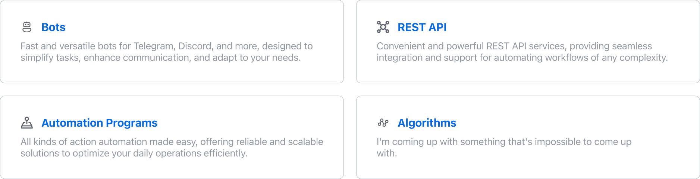

<h3 style='font-size: 20px'> About me</h3>

I specialize in the development of backend applications, crafting APIs, building Telegram bots, designing intricate algorithms, and creating automation tools. My passion lies in transforming complex problems into streamlined, high-performance solutions.

My approach focuses on creating systems that are both robust and intuitive. I tailor each project to meet specific needs, ensuring that your software is not only efficient but also user-friendly. My primary objective is to effectively communicate your vision while preserving the unique identity of your product through cutting-edge technology.

#

<h3 style='font-size: 20px'> What i'm doing </h3> 

<h3 style='font-size: 20px'> Skills</h3>

